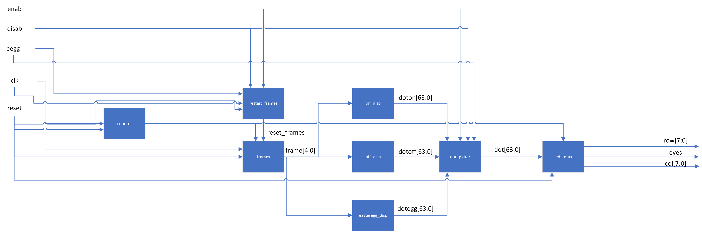

# New Hardware
There are two major pieces of new hardware in this project. The first major piece of new hardware is a servo motor.  The motor is used to control the movement of the opening and closing of the mask. This is done by using pulse width modulation. The servo motor takes a PWM signal in as an input and based on the duty cycle of that signal, the motor changes its position. By using a timer with a customizable PWM output we are able to rotate the motor to whatever position we desire. This controls the opening and closing of the mask. Although PWM has been covered in the class before, it was focused on frequency and note pitch. This application is focused on modular duty cycles and how they can be used to control motors. 

The second piece of new hardware is the 8x8 LED matrices. LEDs and segment displays have been used previously in the class but not in this way. Previously, they were used as less of dynamic displays. They would only update when the inputs changed or by a very simple clock divider, the LED matrices being used here are very dynamic, they play through short animations on their own and they use time multiplexing to display any pattern/combination of the 64 available LEDs in the 8x8 matrix. Combining time multiplexing with an LED matrix this large in addition to showing constantly updating patterns expands on the simple multiplexing that was done in an earlier lab.

# MCU Design

The MCU serves two functions. The first is to interface with the distance sensor and the second is to control the Mini Metal Gear Analog Servo. 

The servo is controlled using PWM from TIM2 on the MCU. As mentioned before, different duty cycles correspond to different rotational positions for the servo. Once the input to change the position of the helmet from open to closed or closed to open, the PWM duty cycle is changed. The motor requires a lot of current in order to operate due to the fact that it requires a significant amount of torque to move the mask with all of its wires and LEDs. The PWM signal is simply the control signal for the motor, the power comes from a 5V benchtop power supply. This is because the power supply is able to supply far more current than the FPGA or MCU would be able to and thus can safely drive the motor without worrying about blowing out a GPIO pin with too much current or not being able to provide enough current for the torque. Below is shown the timing diagram of the modular PWM signal on TIM2 of the MCU [2].

The MCU also keeps track of which state it is in (open/closed) as well as polling whether the FPGA has sent it the signal that it is in the enable state. This way, the MCU will only drive the motor if the system is enabled. The open/closed tracking is used not only for which position it should move the motor to when it is told to switch, but also for telling the FPGA so that it can know if the mask is open or closed.

## MCU Block Diagram

# FPGA Design
The FPGA has two major uses in the helmet. The first is reading the 4x4 matrix keypad. The keypad is used to detect whether or not the helmet is in its enabled mode. The helmet starts in a disabled mode, if the correct keypad code is put into the keypad, the helmet goes into the enabled mode. When the helmet is in the disabled mode the eye lights stay off and the mask will not be able to be opened. Once the correct enable code is put into the keypad the eyes light up and the mask is then able to be opened and closed using the gesture sensor. The second major use of the FPGA is the LED eyes. Each eye is made up of 8x8 LED matrices. When the correct enable code is put into the keypad, a short animation is played of the lights coming on. Another easter egg enable code is also installed. If that code is put into the keypad a different, cooler, animation is played on the eye LEDs before the helmet is put into the enable mode.
Once the keypad is in the enable mode it will stay enabled until the correct disable code is input. Even if random keys are pressed on the keypad, it will stay enabled unless the disable code is input. Once that disable code is input a powering-down animation will play on the eyes and the helmet will be put back into disable mode with the eyes off.

The keypad code detection works by reading the inputs from the keypad matrix, storing the five most recent inputs in registers, and then comparing the values in those registers to the known enable/disable codes. The FPGA reads the keypad by scanning through the columns while reading the rows. It works using a finite state machine, quickly flipping between four states, each one corresponding to a column. When the state is on the corresponding column that column is driven high. When a button is pressed, the corresponding row and column are connected. The FSM cycles through the columns very quickly so once any of the rows detects an input, the FPGA can determine which corresponding button on the keypad was pressed by seeing which row the input is on and which column the FSM is in. It then stays in a hold state until the button is released and it goes back to scanning through rows. Five registers store the five most recent button presses, as each button is pressed the value of each register is shifted by one register, and the most recent value is put into the first register.

  

The code detection and enable state are also done using finite state machines. The system starts in the disabled state. Once the right five digits in the right order are stored in the registers the state changes from disabled to enabled. It will stay in that state until the correct disable code is input where it will then enter the disabled state. The FPGA sends a signal to the MCU via GPIO telling it whether or not it is enabled. 

  

Once the system detects a change in the state, it will play a multi-frame animation on the LED eyes. This is done by starting a frame counter as soon as the state changes. Each frame has a combination of LEDs that correspond to it for each different lighting sequence (enable, secret code enable, and disable). A multiplexer then decides which of the frames to display based on the enable state and the frame. Because each LED matrix has 64 total LEDs but only 16 pins, it is necessary to use time multiplexing to display any combination of the LEDs. This works by cycling through each row of the LED matrix and lighting up the LEDs in the specified columns in that row. By cycling through the rows fast enough it is possible to seamlessly display any pattern on the LEDs. By using time multiplexing, frame counting, and multiplexing based on the enable state the system can display multiple unique animations and frames for each power up/down sequence.

## FPGA Block Diagram

  

Shown above is the top-level FPGA block diagram. This is the module that calls all other modules and has the FPGA inputs and outputs. Many of these modules have sub-modules or finite state machines that help them operate. The top-level module calls the modules that operate the keypad and the LEDs. The synchronizer simply synchronizes the inputs from the rows with the clock. The keypad scanner module is the main module that deals with scanning through the columns and determines which button was pressed. It sends the info for the keypresses to the hex digit module. The hex digit module stores the five most recent key presses and compares those to the known codes. The information of whether a code is stored in the registers is then sent to the combinational logic and dig check modules to determine which state the system should be in and what values to output. The functionality and finite state machine diagrams are described in the section above. 

  The module led_outputs is the module that controls the LED eyes. It performs the required calculations to determine which LEDs to turn on and at which time. The block diagram is shown below. 

The modules frames and restart frames are responsible for keeping track of which frame to display. The frames module simply counts up and then stops once it hits the desired frame number, restart frames tells the frames module to start from the beginning whenever the system enters a new state. The frame is fed into each of the on_disp, off_disp, and easteregg_disp. These three modules all calculate which dots to turn on in the matrix based on what frame the system is on. It sends that information to the out picker module which determines which dots will be displayed based on what state the system is in. That is then given to the led time multiplexing module which outputs which rows and columns to drive. The time multiplexing works by very quickly cycling through the rows and driving the corresponding column for the dots on that row.

The LEDs controlled by time multiplexing are not the only LEDs that light up. Those two matrices that can display patterns are in the center of the eyes. Each eye has three LED matrices in total for a total of six across the whole helmet. The two matrices on each eye that are not controlled by time multiplexing are controlled using a common anode and cathode. This was because there are not enough pins on the FPGA to be able to give six different LED matrices with 16 pins each their own set of GPIO pins, instead some of the matrices are only able to turn on or off. Because there are four LED matrices all wired together, a single GPIO pin is not able to produce enough voltage or current into order to light all of the LEDs. To solve this problem, we use a benchtop power supply with 20 volts. That voltage supply is connected to a relay, when the relay switches, it turns on or off the LEDs connected to the common anode/cathode. The relay also requires more voltage and current than the GPIO pins are able to supply so again we turn to the benchtop power supply. Using the same 5 volt output that powers the motor and a NPN transistor we are able to use a GPIO pin. The GPIO pin switches the transistor which gives the relay enough power to switch which gives the LEDs enough power to turn on. This way we can control a large amount of power (and lights) using only one GPIO pin despite the fact that it has a low power output capacity.

## Discussion of Setbacks

Unfortunately, we were unable to get I2C working with the APDS-9960 gesture sensor. Our first attempt was a bare-metal approach, copying a similar format to past labs, creating correspnding .c and .h files. Before explaining in detail of our issues, here is some information about I2C. The I2C protocol, short for Inter-Integrated Circuit, is a communication protocol primarily used for low-speed, short-distance communication between multiple devices. It uses only two bidirectional open-drain lines, Serial Data (SDA) and Serial Clock (SCL), with each device on the I2C bus being software-addressable by a unique address.

To start I2C, there is an initialization process, which includes enabling the clock for GPIOB (since we chose pins B6 and B7 for SCL and SDA respectively), setting those GPIOS to open drain, alternate function mode, setting AF04 as the alternate function selection, and setting the appropriate bits in the I2C_TIMINGR register, depending on the device communicating over I2C.

Next, we wrote functions for reading and writing over I2C, seemingly following steps in the diagrams provided in the 
<a href="https://pages.hmc.edu/brake/class/e155/fa23/assets/doc/rm0394-stm32l41xxx42xxx43xxx44xxx45xxx46xxx-advanced-armbased-32bit-mcus-stmicroelectronics.pdf">MCU's reference manual</a>.
However, for some reason still unknown to us, the bits that are meant to be cleared after a write transfer are never cleared. In our debugging process, we first looked at the I2C initilization code, but could not find any glaring problems. Our next instinct was to look at the many status registers the MCU was already providing to us. We then reflashed our MCU with error flag checking, but none of them were present. And again, we were still stuck at the same place.

At this point, we looked to using <a href="https://www.st.com/en/development-tools/stm32cubeide.html">STM32CubeIDE</a> with HAL. Setting up the project in ST's software was fairly simple, and we proceeded to generate some code based on our selections for enabling I2C, as well as essentially everything that we wrote in our bare metal I2C initialization. Next, using the already provided I2C init, read, and write functions, we ran a test I2C communication, and it failed with the same result in our bare metal one. (Also, but somewhat an aside, SEGGER, in our opinion, is much easier to use/deal with than STM32CubeIDE. Further, we struggled to flash our MCU from ST's software, but luckily SEGGER has support for importing STM32CubeIDE projects directly into SEGGER. However, in our experience this importing process does not work on Mac unless you have a Windows VM.)

After this struggle, we decided that maybe it was the APDS-9960. Just to give some context on this sensor: it has many different features, including gesture, proximity, and color detection and is inside the <a href="https://www.sparkfun.com/products/12787">Samsung Galaxy S5</a>. The complexity felt overwhelming at this point, and we decided to switch to the <a href="https://www.adafruit.com/product/4742">RCWL-1601</a>, an ultrasonic distance sensor. Sadly, to break the bad news, we could not get this sensor to work either, but this was probably more due to time constraints. To not discount our efforts though, this specific sensor is a highly similar to another much more widely known <a href="https://www.sparkfun.com/products/15569">HC-SR04</a> ultrasonic sensor, but it has some differences that were painful to get through. Unlike the traditional HC-SR04, the RCWL-1601 uses I2C, while the HC-SR04 has a straightforward communication process: the MCU sends a 10µs trigger pulse to the trigger pin, and the sensor responds with an echo pulse from the echo pin, where the pulse duration corresponds to a proximity measurement. 

