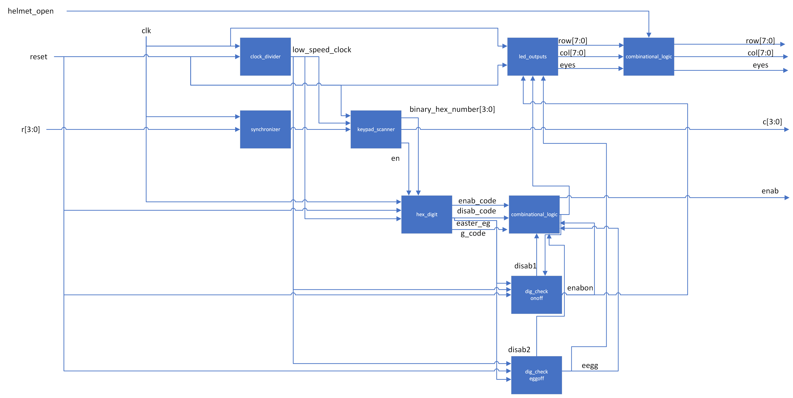

# New Hardware
There are two major pieces of new hardware in this project. The first is the APDS 9960 motion/gesture sensor. This sensor is being used to detect when to open and close the mask. The other new hardware is the EMAX ES08MA servo motor. The motors are used to control the movement of the opening and closing of the mask.

# MCU Design

The MCU serves two functions. The first is to interface with the APDS 9960 motion/gesture sensor over I2C, and the second is to control the Mini Metal Gear Analog Servo. 

## MCU Block Diagram

# FPGA Design
The FPGA has two major uses in the helmet. The first is reading the 4x4 matrix keypad. The keypad is used to detect whether or not the helmet is in its enabled mode. The helmet starts in a disabled mode, if the correct keypad code is put into the keypad, the helmet goes into the enabled mode. When the helmet is in the disabled mode the eye lights stay off and the mask will not be able to be opened. Once the correct enable code is put into the keypad the eyes light up and the mask is then able to be opened and closed using the gesture sensor. The second major use of the FPGA is the LED eyes. Each eye is made up of 8x8 LED matrices. When the correct enable code is put into the keypad, a short animation is played of the lights coming on. Another easter egg enable code is also installed. If that code is put into the keypad a different, cooler, animation is played on the eye LEDs before the helmet is put into the enable mode.
Once the keypad is in the enable mode it will stay enabled until the correct disable code is input. Even if random keys are pressed on the keypad, it will stay enabled unless the disable code is input. Once that disable code is input a powering-down animation will play on the eyes and the helmet will be put back into disable mode with the eyes off.

The keypad code detection works by reading the inputs from the keypad matrix, storing the five most recent inputs in registers, and then comparing the values in those registers to the known enable/disable codes. The FPGA reads the keypad by scanning through the columns while reading the rows. It works using a finite state machine, quickly flipping between four states, each one corresponding to a column. When the state is on the corresponding column that column is driven high. When a button is pressed, the corresponding row and column are connected. The FSM cycles through the columns very quickly so once any of the rows detects an input, the FPGA can determine which corresponding button on the keypad was pressed by seeing which row the input is on and which column the FSM is in. It then stays in a hold state until the button is released and it goes back to scanning through rows. Five registers store the five most recent button presses, as each button is pressed the value of each register is shifted by one register, and the most recent value is put into the first register.

  

The code detection and enable state are also done using finite state machines. The system starts in the disabled state. Once the right five digits in the right order are stored in the registers the state changes from disabled to enabled. It will stay in that state until the correct disable code is input where it will then enter the disabled state.

  

Once the system detects a change in the state, it will play a multi-frame animation on the LED eyes. This is done by starting a frame counter as soon as the state changes. Each frame has a combination of LEDs that correspond to it for each different lighting sequence (enable, secret code enable, and disable). A multiplexer then decides which of the frames to display based on the enable state and the frame. Because each LED matrix has 64 total LEDs but only 16 pins, it is necessary to use time multiplexing to display any combination of the LEDs. This works by cycling through each row of the LED matrix and lighting up the LEDs in the specified columns in that row. By cycling through the rows fast enough it is possible to seamlessly display any pattern on the LEDs. By using time multiplexing, frame counting, and multiplexing based on the enable state the system can display multiple unique animations and frames for each power up/down sequence.

## FPGA Block Diagram

  

Shown above is the top-level FPGA block diagram. This is the module that calls all other modules and has the FPGA inputs and outputs. Many of these modules have sub-modules or finite state machines that help them operate. The top-level module calls the modules that operate the keypad and the LEDs. The synchronizer simply synchronizes the inputs from the rows with the clock. The keypad scanner module is the main module that deals with scanning through the columns and determines which button was pressed. It sends the info for the keypresses to the hex digit module. The hex digit module stores the five most recent key presses and compares those to the known codes. The information of whether a code is stored in the registers is then sent to the combinational logic and dig check modules to determine which state the system should be in and what values to output. The functionality and finite state machine diagrams are described in the section above. 

  The module led_outputs is the module that controls the LED eyes. It performs the required calculations to determine which LEDs to turn on and at which time. The block diagram is shown below. 

  

The modules frames and restart frames are responsible for keeping track of which frame to display. The frames module simply counts up and then stops once it hits the desired frame number, restart frames tells the frames module to start from the beginning whenever the system enters a new state. The frame is fed into each of the on_disp, off_disp, and easteregg_disp. These three modules all calculate which dots to turn on in the matrix based on what frame the system is on. It sends that information to the out picker module which determines which dots will be displayed based on what state the system is in. That is then given to the led time multiplexing module which outputs which rows and columns to drive. The time multiplexing works by very quickly cycling through the rows and driving the corresponding column for the dots on that row.
