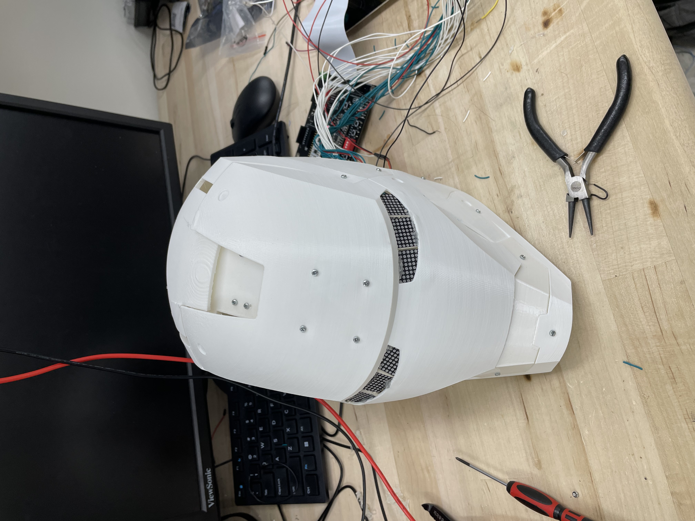
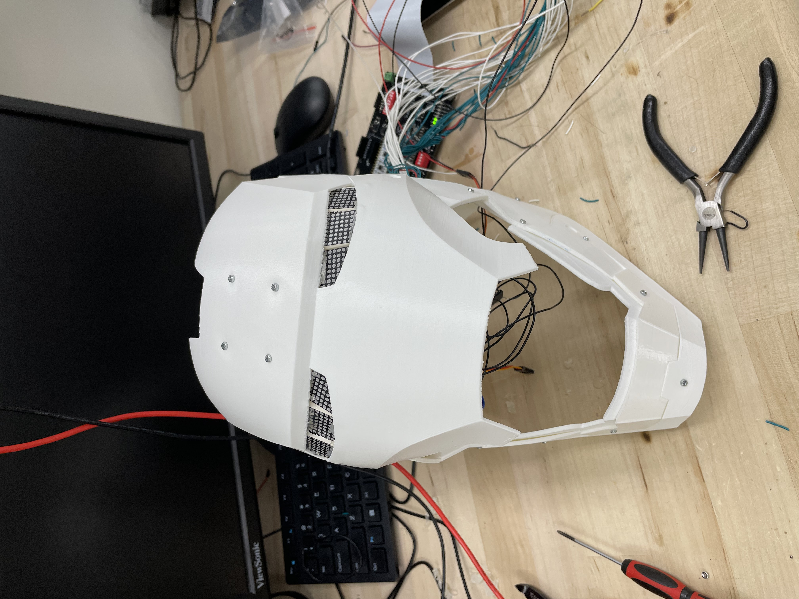
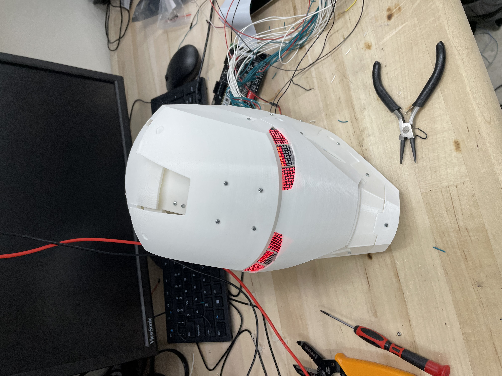
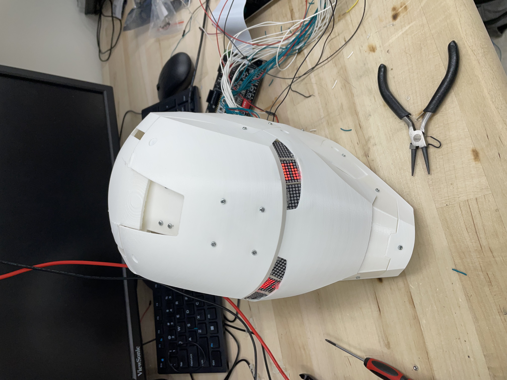

# Demonstration of Project

Below is a video showing the results of the project. 

<iframe width="560" height="315" src="https://www.youtube.com/embed/C_qrYeCEahk" frameborder="0" allow="autoplay; encrypted-media" allowfullscreen></iframe>

As you can see the helmet is able to open and close and the eyes light up in different patterns based on if it is open or closed, enabled or disabled. Below are various states of function of the helmet.

# Results

The main goal of our project was to make a cool Iron Man helmet that was able to open and close and had light-up eyes. We also wanted it to have gesture sensing so that it would be able to be opened and closed based on different gestures. In the first part, we succeeded. We were able to successfully 3D print the Iron Man helmet, install servos and LED eyes, and control it using the FPGA and MCU. We were unsuccessful in using the gesture sensor to control the system so we instead opted for a button to toggle the opening and closing of the helmet. Although we did not reach all of our goals we were able to make a functional helmet with the physical features that we wanted, we just were not able to implement the input mode that we wanted. The eyes light up in cool patterns and react to the helmet opening and closing, the keypad is able to control the helmet and triggers different display patterns on the eyes, and the motor is able to toggle between the open and closed position based on inputs from the keypad and button. We were having a lot of difficulty with I2C and the sensor in general. It was unclear if the sensors were broken or if there was an issue with our I2C code, but either way, we were not able to successfully interface the MCU with the APDS gesture sensor.
